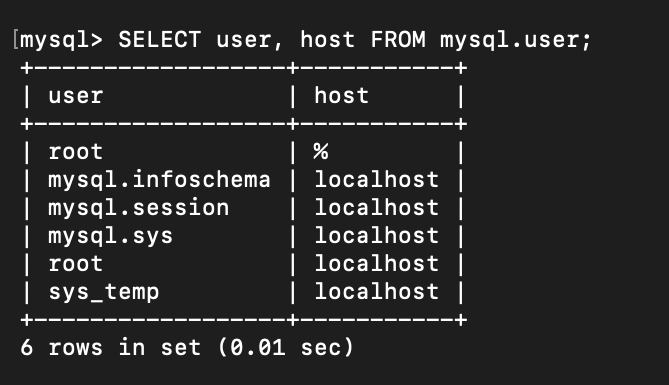

# Домашнее задание «Работа с данными (DDL/DML)»
ФИО: Гридин Владимир 

---

## Задание 1

### 1.1 Поднятие MySQL 8.0+

- Способ: Docker-контейнер  
- Команда запуска:

```bash
docker run --name mysql8 -e MYSQL_ROOT_PASSWORD=root -p 3306:3306 -d mysql:8.0
```

### 1.2 Создание учётной записи sys_temp

```bash
CREATE USER 'sys_temp'@'localhost' IDENTIFIED WITH mysql_native_password BY 'password';
```

### 1.3 Список пользователей

Скриншот:



Запрос:

```bash
SELECT user, host FROM mysql.user;
```

### 1.4 Выдача всех прав

```bash
GRANT ALL PRIVILEGES ON *.* TO 'sys_temp'@'localhost' WITH GRANT OPTION;
FLUSH PRIVILEGES;
```

### 1.5 Проверка прав для sys_temp

Скриншот:


Запрос:

```bash
SHOW GRANTS FOR 'sys_temp'@'localhost';
```

### 1.6 Переподключение

```bash
mysql -u sys_temp -p
```

### 1.7 Скачивание и восстановление дампа Sakila

```bash
wget https://downloads.mysql.com/docs/sakila-db.zip
unzip sakila-db.zip
mysql -u sys_temp -p < sakila-db/sakila-schema.sql
mysql -u sys_temp -p < sakila-db/sakila-data.sql
```

### 1.8 ER-диаграмма / список таблиц

Скриншот из DBeaver:


Команда для CLI:

```bash
USE sakila;
SHOW TABLES;
```

## Задание 2

Таблица первичных ключей базы sakila:

| Название таблицы | Название первичного ключа |
| ---------------- | ------------------------- |
| actor            | actor\_id                 |
| address          | address\_id               |
| category         | category\_id              |
| city             | city\_id                  |
| country          | country\_id               |
| customer         | customer\_id              |
| film             | film\_id                  |
| film\_actor      | (actor\_id, film\_id)     |
| film\_category   | (film\_id, category\_id)  |
| film\_text       | film\_id                  |
| inventory        | inventory\_id             |
| language         | language\_id              |
| payment          | payment\_id               |
| rental           | rental\_id                |
| staff            | staff\_id                 |
| store            | store\_id                 |

